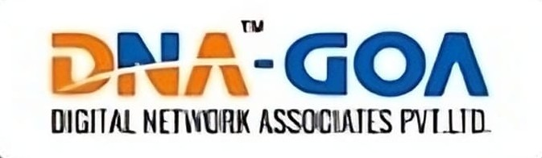

<p align="center">
  
</p>

<h1 align="center">Cyber Security Awareness Platform</h1>

<p align="center">
  <b>Empowering everyone to stay safe online through education, interactive tools, and real-time threat awareness.</b>
</p>

<p align="center">
  <a href="https://github.com/AASHVA-bit/final"></a>
  <a href="https://github.com/AASHVA-bit/final"></a>
  
  
</p>

---


---

## 📚 Table of Contents
- [Overview](#overview)
- [Features](#features)
- [Tech Stack](#tech-stack)
- [Screenshots](#screenshots)
- [Getting Started](#getting-started)
- [Usage](#usage)
- [API Reference](#api-reference)
- [Contributing](#contributing)
- [License](#license)
- [Credits](#credits)

## 🚀 Overview

Cyber Security Awareness Platform is a modern, interactive web application designed to educate and protect users from cyber threats. It provides essential resources, tools, and real-time information for all age groups, making cyber safety accessible and engaging.

## ✨ Features

- **Threat Encyclopedia:** Guides and visuals for threats like phishing, malware, ransomware, DDoS, social engineering, and more.
- **Live News Section:** Latest cyber security news and alerts.
- **Password Strength Checker:** Evaluate and improve your passwords instantly.
- **SMS Scam Detector:** Analyze suspicious messages for scams.
- **AI Chatbot:** Get instant answers to cyber security questions.
- **Child & Senior Safety:** Dedicated resources for vulnerable groups.
- **Global Threat Map:** Visualize real-time cyber threats worldwide.
- **Responsive UI:** Seamless experience across devices.

## 🛠️ Tech Stack
- **Frontend:** React.js
- **Backend:** Node.js (Express)
- **APIs:** Custom news API
- **Styling:** CSS, modern UI components
- **Deployment:** Local/Cloud

## 🖼️ Screenshots
<p align="center">
  
  
</p>

## 📁 Project Structure
```
cyber-security-main/
├── api/
│   └── news.js
├── public/
│   ├── index.html
│   └── imgs/
│       └── [threat, safety, and demo images]
├── src/
│   ├── App.js
│   ├── index.js
│   └── components/
│       ├── BentoGrid.js
│       ├── Chatbot.js
│       ├── ChildSafety.js
│       ├── Footer.js
│       ├── Hero.js
│       ├── Navbar.js
│       ├── NewsSection.js
│       ├── PasswordChecker.js
│       ├── SeniorSafety.js
│       ├── SMSDetector.js
│       └── ThreatMap.js
├── package.json
└── .env
```

## 🏁 Getting Started
1. **Clone the repository**
   ```powershell
   git clone https://github.com/AASHVA-bit/final.git
   ```
2. **Install dependencies**
   ```powershell
   npm install
   ```
3. **Start the development server**
   ```powershell
   npm start
   ```
4. **Open in browser**
   Visit [http://localhost:3000](http://localhost:3000)

## 🧩 Usage
- Browse threat guides and safety tips.
- Use the Password Checker and SMS Detector for instant analysis.
- Chat with the AI bot for advice and information.
- View the Threat Map for global insights.

## 🔗 API Reference
- The `api/news.js` file provides news data for the News Section.

## 🤝 Contributing
We welcome contributions from the community! To contribute:
1. Fork the repository
2. Create your feature branch (`git checkout -b feature/AmazingFeature`)
3. Commit your changes (`git commit -m 'Add some AmazingFeature'`)
4. Push to the branch (`git push origin feature/AmazingFeature`)
5. Open a Pull Request

Please read our [Code of Conduct](CODE_OF_CONDUCT.md) before contributing.

## 📄 License
This project is licensed under the MIT License. See the [LICENSE](LICENSE) file for details.

## 🙌 Credits
- Developed by [AASHVA-bit](https://github.com/AASHVA-bit)
- Thanks to all contributors and the open-source community

---

<p align="center">
  <b>Stay Safe. Stay Informed. Stay Empowered.</b>
</p>
